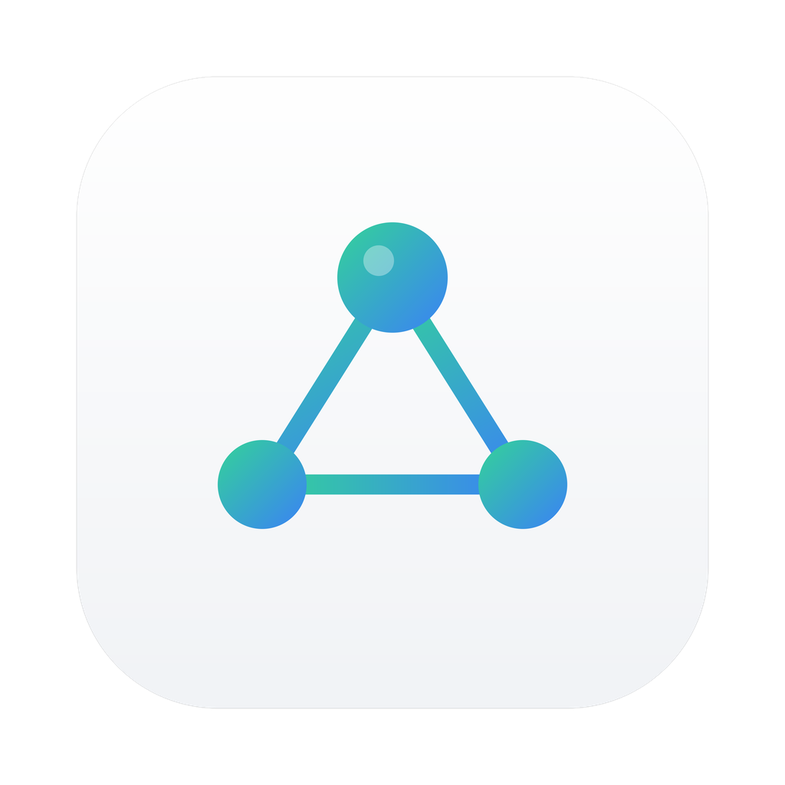
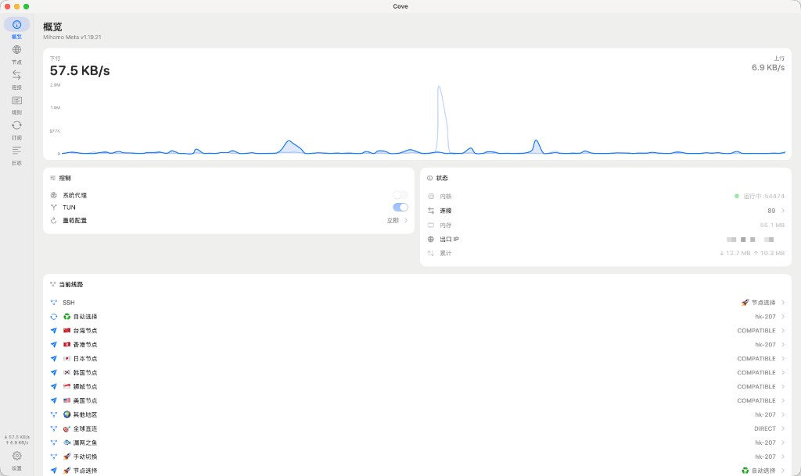

  

  <h1>Cove</h1>

  

    macOS 上的原生 <a href="https://github.com/MetaCubeX/mihomo">mihomo</a> 客户端 
    菜单栏开关代理，主窗口看线路、流量和连接
  

---

适合想要一个轻量、跟系统长得像的代理客户端：导入订阅就能用，需要时再打开 TUN。界面是原生 Swift，不内嵌浏览器。

## 预览

  

## 能做什么

- **菜单栏**：看运行状态和上下行速率，启停内核，开关系统代理，在规则 / 全局 / 直连之间切换。
- **概览**：流量、内核状态、当前线路，以及 TUN 与系统代理开关。
- **节点**：按订阅里的策略组选线路。
- **连接**：每条连接的目标、规则、节点和实时速率。
- **规则**：查看生效规则，并添加自己的规则。
- **订阅**：贴上链接导入。点哪张卡片就切到哪条，同时只会启用一条，节点立刻更新。
- **日志**：内核日志按时间、级别和内容阅读。
- **设置**：混合端口、日志级别、开机自启、启动时是否打开窗口、是否在 Dock 显示。

关掉「在 Dock 中显示」后，Cove 只留在菜单栏。

## 两种上网方式

| | 系统代理 | TUN |
|---|---|---|
| 覆盖范围 | 遵守系统代理的应用 | 本机全部流量 |
| 是否需要管理员 | 需要特权助手 | 需要特权助手 |
| 适合 | 浏览器和常见应用 | 不走系统代理的软件 |

安装特权助手时会弹出系统授权框，支持触控 ID。装好之后，开关 TUN 和系统代理都不再询问。

TUN 会把系统 DNS 指到 `198.18.0.1`，由 mihomo 解析，避免系统绕过虚拟网卡去问外部 DNS。

## 开始使用

1. 在「订阅」页导入链接，点卡片设为当前订阅。
2. 启动内核。
3. 若要 TUN 或系统代理，先在「设置」里安装特权助手。
4. 在「节点」页选择线路。

已有完整的 Clash 配置时，可以在订阅页指定该文件。Cove 只读使用，不会改写它。

从源码打包见 [构建说明](docs/build.md)。

## 许可

Cove 以子进程方式运行 [mihomo](https://github.com/MetaCubeX/mihomo)（GPL-3.0），不把内核代码链进应用。Cove 自身的界面与控制代码可按仓库许可使用。
